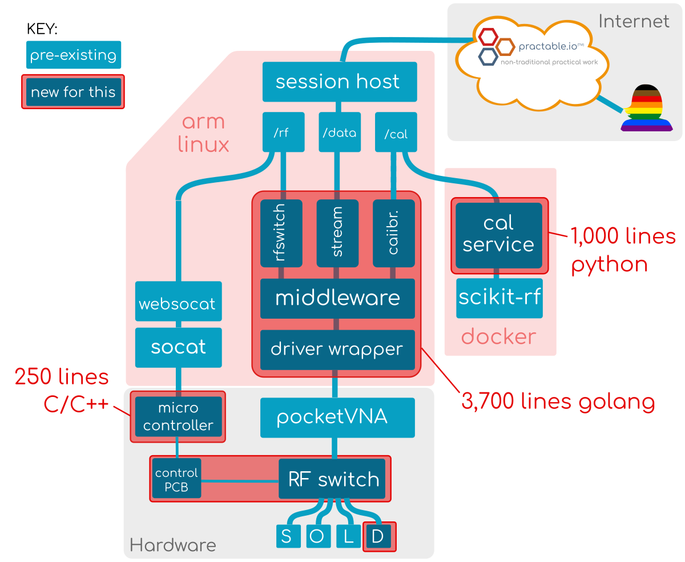
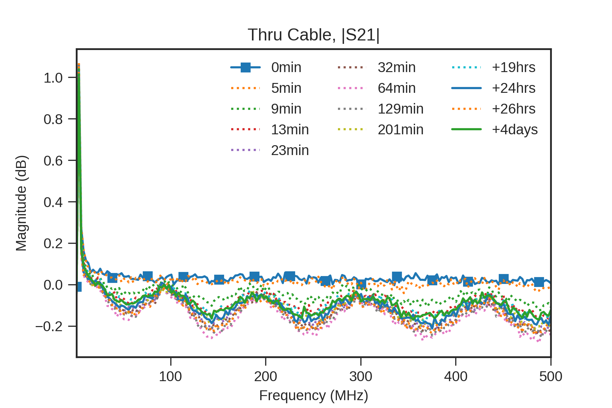
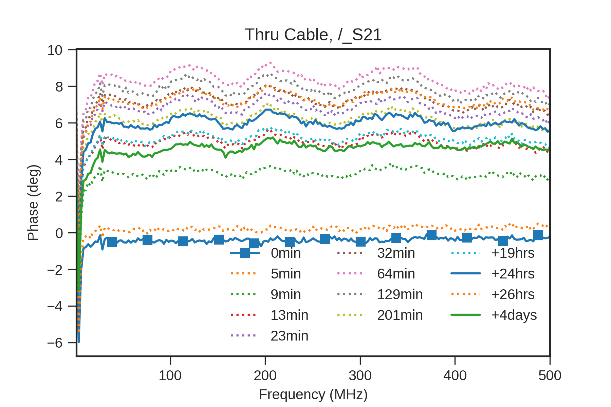

# go-pocketvna

A golang-based web service for the pocketvna.com](https://pocketvna.com/) vector network analyser, with an automated one-port calibration facility provided by additional RF hardware, for use with the open-source [practable.io](https://practable.io] remote lab ecosystem. The user interface is similar to [this](https://github.com/dpreid/pidui), although not yet publically released by the developer (coming soon!)

## Overview

This repo contains code and design files for the key parts of the system.

- golang wrapper for the pocket-vna
- golang middleware and clients for the rf-switch and calibration services 
- python calibration service using scikit-rf & websocket libraries
- docker containerisation of the python calibration service
- C/C++ firmware for an arduino nano microcontroller
- PCB for a logic level shifterthat can control a 4-port RF switch mounted on an evaluation board

The largest part of this repo is the golang executable `vna` which sequences tasks between the four major parts: 
- user (via websocket service, routed through session host from the external practable.io ecosystem)
- vector network analyser (via golang-wrapped shared C library; local USB connection to hardware)
- rf switch controller (via websocket service, routed through session host; local USB connection to hardware)
- calibration service (via websocket service, routed through session host; runs on local docker container)

`vna` also supplies a `unlock` command to free up any pocketVNA connected to the computer. It is assumed that you only have one VNA per computer (it's possible to support more, and to choose explicitly, but that is not implemented. Our use case is one VNA per host computer,  and we want to auto-discover the VNA).



For example, in order to perform a calibration, the golang code does the following tasks

- set the RF switch to the short cal standard
- scan the short, and store the data
- set the RF switch to the open cal standard
- scan the open, and store the data
- set the RF switch to the load cal standard
- scan the load, and store the data
- check all the data are of the correct length

To supply calibrated scans, the golang code does the following

- set the RF switch to the device under test (or whichever cal standard the user is interested in scanning)
- scan the device under test with the same parameters for which we have cal-standard data
- combine the dut data with the cal standard data, and send to the calibration service
- receive the results, re-format the data, and send it to the user

There is a <100ms performance overhead in sending the cal data to the calibration service each time, but this is much smaller than the scan times (tens of seconds), and avoids duplicating state (such as knowledge of what frequency points are being used, and when the cal standards were last scanned).

## Future expansion

Our preferred languages for each of the different parts of the system spanned golang, C/C++ and python. Instead of trying to tightly integrate them or duplicate functionality in one or the other, the JSON-over-websockets communication method was used to separate out concerns, facilitate testing, and allow replacing the RF switch circuit to support two-port cal, add extra calibration methods, and upgrade the API offered to the user to support the extra hardware.

## Installation 

This can be a bit finicky because the pocketVNA library has different name and requirements for different targets, and is only available as compiled source so cannot be automatically built for your target. The manufacturers support a number of major operating systems and platforms, so you should be ok. This code has been tested on amd64/linux and arm/linux.

### vna install 

The core of this repo is the `vna` executable.

0. Download this repo (`git clone git@github.com:timdrysdale/go-pocketvna.git`)
0. replace pkg/pocket/libPocketAPI.so with the appropriate pocketVNA library for your target
0. copy that library to your system path, e.g. for linux /usr/lib (for linux amd64/arm, add `.0` so the ending is `...so.0`)
0. get all dependencies `go get -u ./...' (you may need to add or remove the -lm flag for linking the maths library - not needed on linux 64 bit but needed on Raspbian buster
0. Compile the vna command (`go mod init github.com/timdrysdale/go-pocketvna && cd cmd/vna && go build`)
0. copy the `vna` executable to your usual location on the path (`go install` or do by hand)
0. check it is installed by trying `vna stream --help`

```
vna stream --help
Stream connects the first available pocketVNA to a websocket server. The websocket server is specified via an environment variable

export VNA_DESTINATION=ws://localhost:8888/ws/vna
export VNA_CALIBRATION=ws://localhost:8888/ws/calibration
export VNA_RFSWITCH=ws://localhost:8888/ws/rfswitch

vna stream 

Note that development can be enabled by setting environment variable VNA_DEVELOPMENT
export VNA_DEVELOPMENT=true

Usage:
  vna stream [flags]

Flags:
  -h, --help   help for stream
```


### session install

Install `session` from [practable.io](https://github.com/practable/relay)

If you are using the experiment remotely, you should configure a script to set the forwarding rules at start up (your practable.io admin contact will have details of the tokens etc your experiment needs)

session-rules
```
#!/bin/sh
dataTokenFile="/etc/practable/data.token"
dataAccessFile="/etc/practable/data.access"

dataToken=$(cat "$dataTokenFile")
dataAccess=$(cat "$dataAccessFile")

curl -X POST -H "Content-Type: application/json" -d '{"stream":"data","destination":"'"${dataAccess}"'","id":"1","token":"'"${dataToken}"'"}' http://localhost:8888/api/destinations 
```
This script can be run at start up by enabling a systemd service. The service file is in [services](./ansible/services)

### Docker install

Python is often used for system tasks, so we run our calibration service in a docker container to avoid any version and dependency conflicts.

The steps to manually install Docker are:

```
sudo apt update
# optional:
# sudo apt-upgrade && sudo reboot
curl -fsSL https://get.docker.com -o get-docker.sh
chmod +x ./get-docker.sh
sudo ./get-docker.sh

# for non-privileged use
dockerd-rootless-setuptool.sh install
#check you have docker running
docker version 
#sudo usermod -aG docker $(whoami) #this not be needed -
sudo chmod 666 /var/run/docker.sock #avoid permission denied
#sudo reboot #let all the changes take effect
#<wait for reboot>
```

Build and start the docker image (use tmux if you are ssh'ing into your rpi, so you can have extra terminals open)
```
cd py/app
./start/sh
```
Note: you might see this error when building on rpi4/rpios(buster)

```
Fatal Python error: _Py_InitializeMainInterpreter: can't initialize time
PermissionError: [Errno 1] Operation not permitted
```

An issue with building `time` on rpios (`lsb_release -a` reports I am using buster) is discussed [here](https://community.home-assistant.io/t/migration-to-2021-7-fails-fatal-python-error-init-interp-main-cant-initialize-time/320648/9) and solves the problem:
```
sudo apt-key adv --keyserver keyserver.ubuntu.com --recv-keys 04EE7237B7D453EC 648ACFD622F3D138
echo "deb http://deb.debian.org/debian buster-backports main" | sudo tee -a /etc/apt/sources.list.d/buster-backports.list
sudo apt update
sudo apt install -t buster-backports libseccomp2
```

numerical libraries are required for [building scipy](https://docs.scipy.org/doc/scipy/reference/building/linux.html)
```
sudo apt-get install gcc gfortran python3-dev libopenblas-dev liblapack-dev
```


An issue with building numpy on rpi (many error messages produced) is solved by adding buildtools to the Dockerfile [as described here](https://stackoverflow.com/questions/63971185/unable-to-install-numpy-on-docker-python3-7-slim-in-a-raspberry-pi)
Change
```
RUN pip install -r /var/www/requirements.txt
```
to

```
RUN apt-get update && \
    apt-get install -y \
        build-essential \
        make \
        gcc \
    && pip install -r /var/www/requirements.txt \
    && apt-get remove -y --purge make gcc build-essential \
    && apt-get autoremove -y \
    && rm -rf /var/lib/apt/lists/*
```

The build is much slower on rpi4 than desktop because the python dependencies are being compiled.

TODO - confirm here that these steps are sufficient to get the Docker to build on rpi.


## vna setup
 
The usage / setup is mostly the same for a local system running on a desktop for testing, or deployed on a raspberry pi for remote access. The remote system tends to have everything autostart on boot, and include some setup to make a connection to the `practable.io` infrastructure servers. This is added complication that you do not need, and may not want, if working on a desktop. Starting the services manually is fine. Start `session host` first, then `websocat`, then you can start `socat`, `vna stream` and the `docker` calibration service in any order. The system will only supply calibrated data when the rfswitch and calibration services are running.

It is recommended to try unlocking the devices first - just in case the service is restarting and the pocketVNA was locked by the previous instance

The websocket connections between services are specified by environment variables, so that `vna stream` knows where to find them. The `session host` does not mind which particular endpoints are used - but the endpoints must be set the same for `vna stream` and the service that it is connecting to. The full instantiation of the [practable.io](https://practable.io) services on the host computer (usually a raspberry pi) are out of the scope of this documentation (early adopters are encouraged to contact us for information on how to obtain support <support@practable.io>).

Assuming your target is already running [relay/sessionhost](https://github.com/timdrysdale/relay) (see `cmd/session`), then you can use the following files to automate the startup of the services you need:

vna-data:
```
#!/bin/bash
export VNA_DESTINATION=ws://localhost:8888/ws/data
export VNA_CALIBRATION=ws://localhost:8888/ws/calibration
export VNA_RFSWITCH=ws://localhost:8888/ws/rfswitch
vna unlock
vna stream
```

socat-data:
```
#!/bin/sh
socat /dev/ttyUSB0,echo=0,b57600,crnl tcp:127.0.0.1:9999
```

websocat-data:
```
#!/bin/sh
websocat ws://localhost:8888/ws/data tcp-listen:127.0.0.1:9999 --text
```


### Service files

Service files are in <./ansible/services>. Note most are fairly similar, except `socat-data` which must wait long enough that `websocat-data` has started (ca 10s leaves a safe margin in practice).


## Interface 

There are three commands directly supported by the pocketvna shared library:

0. `rr`: get the reasonable frequency range for the device (useful `proof of connection` command when troubleshooting)
0. `sq`: get S-parameters at a single frequency (uncalibrated)
0. `rq`: get S-paramters at a range of frequencies (uncalibrated)

we add two more commands to support calibration, which are the two main commands we use: 

0. `rc`: do a calibration over a frequency range for a certain number of steps 

0. `crq`: get S-parameters frequencies (calibrated), using whatever frequency points were specified in the last `rc`

There is also a heartbeat sent every second from the driver, to let you know it is still connected. You can use the absence of this heartbeat to infer that your connection has dropped (it is unlikely the driver has stopped, although that is technically possible if there is a power outage). This heartbeat is added because VNA experiments are unlikely to use a camera (and we've been using the video to check for connection drops, so without it we need something else to check).

```
{"cmd":"hb"}
```

In order to relate commands to responses you can include an ID `id` (string) and/or time `t` (int) field.

### rr


Command

```
{"cmd":"rr"}
```

Response

```
{"id":"","t":0,"cmd":"rr","range":{"Start":500000,"End":4000000000}}
```

Start is the lowest frequency (in Hz) that the VNA can operate at, and End is the highest.

### sq

`sq` gets the requested S-parameters at a single frequency. 

The parameters are:

    - freq (in Hz) at which to take the measurement at
	- avg number of times to take the reading (which are then averaged together)
	- sparam select which S-params are needed - the more you select, the longer it takes

Command:

```
{"id":"945102d5-94e4-448e-bbbf-48384c662711","t":1634664795,"cmd":"sq","freq":100000,"avg":1,"sparam":{"S11":true,"S12":false,"S21":true,"S22":false}}
```
Response:

```
{"id":"945102d5-94e4-448e-bbbf-48384c662711","t":1634664795,"cmd":"sq","freq":100000,"avg":1,"sparam":{"S11":true,"S12":false,"S21":true,"S22":false},"result":{"S11":{"Real":0.0001702234148979187,"Imag":0.0005754455924034119},"S12":{"Real":0,"Imag":0},"S21":{"Real":-0.00004191696643829346,"Imag":-0.00012067705392837524},"S22":{"Real":0,"Imag":0}}}
```

### rq

Get the requested S-parameters at a range of frequencies. Parameters:

    - range (start, end) the start and end of the frequency range to take measurements
	- size the number of separate frequency points to measure at, across the range
	- isLog whether to use a log (isLog = true) or linear (isLog = false) distribution
	- avg number of times to take each reading (which are then averaged together)
	- sparam select which S-params are needed - the more you select, the longer it takes

command
```
{"cmd":"rq","range":{"Start":100000,"End":4000000},"size":2,"isLog":true,"avg":1,"sparam":{"S11":true,"S12":false,"S21":true,"S22":false}}
```

response
```
{"id":"","t":0,"cmd":"rq","range":{"Start":100000,"End":4000000},"size":2,"isLog":true,"avg":1,"sparam":{"S11":true,"S12":false,"S21":true,"S22":false},"result":[{"S11":{"Real":0.00013846158981323242,"Imag":0.00027057528495788574},"S12":{"Real":0,"Imag":0},"S21":{"Real":-0.000031754374504089355,"Imag":-0.0002350062131881714},"S22":{"Real":0,"Imag":0}},{"S11":{"Real":0.00470772385597229,"Imag":0.003948085010051727},"S12":{"Real":0,"Imag":0},"S21":{"Real":0.000017777085304260254,"Imag":-0.000005081295967102051},"S22":{"Real":0,"Imag":0}}]}
```

Note that the frequencies are not (currently) included in the response. They can be calculated according to the formulas given in the openAPI library header, which are (@p denotes a parameter, e.g. ```@p start``` means the parameter start)

```
     *  Distributions:
     *    Linear:      (@p start * 1000 + ((@p end - @p start) * 1000 / (@p steps - 1)) * index) / 1000
     *       (Pay Attention: all numbers are integers. Last element is forced to be equalt to @p end)
     *    Logarithmic: (@p from * powf((float)to / from, (float)index / (steps - 1)))
     *       Formula is taken from 10 ** (lg from +  ( lg to - lg from ) * index /  (steps - 1)). 4-bytes float are used
     *       Pay attention: arithmetic is pretty imprecise on a device
	 
```
These frequency points are calculated in this library, because they are not sent from the hardware. Here is a table of 11 points from 1MHz - 500MHz, taken from the native application for Linear and Log scans. Note that these values from the native app are not quite the same as we expect from the formula for the case of a Log distribution, although the precision issue is acknowledged in the library header file from the supplier as if it is a hardware issue but the values are probably calculated in the native app - the differences are quite small and probably not significant.


| Point  | Linear (both)     |  Log (native app)      | Log (go-pocketVNA)      |  delta |
| -------|-------------|------------|-----------|--------|
| 0      |  1000000    | 1000000    | 1000000   |        |
| 1      |  50900000   | 1861646    | 1861646   |        |
| 2      |  100800000  | 3465724    | 3465724   |        |
| 3      |  150700000  | 6451951    | 6451950   |  -1    |
| 4      |  200600000  | 12011245   | 12011244  |  -1    |
| 5      |  250500000  | 22360680   | 22360680  |        |
| 6      |  300400000  | 41627668   | 41627660  |  -8    |
| 7      |  350300000  | 77495944   | 77495949  |  +5    |
| 8      |  400200000  | 144270000  | 144269991 |  -9    |
| 9      |  450100000  | 268579552  | 268579588 | +36    |
| 11     |  500000000  | 500000000  | 500000000 |        |


### rc

This uses the same JSON structure as the `rq` command, but change `"cmd":"rq"` to `"cmd":"rc"` and ensure that `"sparam":{"S11":true,"S12":false,"S21":false,"S22":false}}` because only cal on port one is supported:

```
{"cmd":"rc","range":{"Start":100000,"End":4000000},"size":2,"isLog":true,"avg":1,"sparam":{"S11":true,"S12":false,"S21":false,"S22":false}}
```

The maximum size is 512, and it is conventional to ask for 501 points for a nice even spacing. A calibration for 501 points takes approx 30 seconds.

### crq

This is a subset of the `rq` object, with `"cmd":"crq"`, and ensure that `"sparam":{"S11":true,"S12":false,"S21":false,"S22":false}}`

```
{"cmd":"crq","avg":1,"sparam":{"S11":true,"S12":false,"S21":false,"S22":false}}
```


## Example data

Good data from a passive device under test always returns a gain of less than 0dB (i.e. without power from a bias supply, it can't add any power of its own) so we can see that in the following results, we should not rely on values close to DC (for the calibration we did, at least). Also, there is some drift in this measurement of a cable, bearing in mind the cable was re-connected after the first few scans and the device moved, so not an entirely fair test on the device. This data was collected in the native app and plotted using python's matplotlib.pyplot.




### Raw data 

```
{"cmd":"rq","range":{"Start":100000,"End":4000000},"size":201,"isLog":true,"avg":1,"sparam":{"S11":true,"S12":true,"S21":true,"S22":true}}
```

Result returns about 15 sec later, with S-parameters at 201 frequency points:

```
{"id":"","t":0,"cmd":"rq","range":{"Start":100000,"End":4000000},"size":201,"isLog":true,"avg":1,"sparam":{"S11":true,"S12":true,"S21":true,"S22":true},"result":[{"S11":{"Real":0.000034302473068237305,"Imag":0.00037600845098495483},"S12":{"Real":-0.0010073482990264893,"Imag":0.00012448430061340332},"S21":{"Real":-0.0013414323329925537,"Imag":0.0005551204085350037},"S22":{"Real":0.00003937631845474243,"Imag":0.00023628026247024536},"Freq":100000},{"S11":{"Real":0.00006987154483795166,"Imag":0.00010670721530914307},"S12":{"Real":-0.0010479986667633057,"Imag":0.00009654462337493896},"S21":{"Real":-0.0013172999024391174,"Imag":0.0008002892136573792},"S22":{"Real":0.00007876008749008179,"Imag":0.0003162994980812073},"Freq":101862},{"S11":{"Real":0.00014227628707885742,"Imag":0.00035568326711654663},"S12":{"Real":-0.0010594278573989868,"Imag":0.0003429800271987915},"S21":{"Real":-0.0013439729809761047,"Imag":0.0009235069155693054},"S22":{"Real":0.00011432915925979614,"Imag":0.0001664087176322937},"Freq":103758}, ... <snip> ...]}
```


## Developer info

These sections contain some information that may be relevant to developers.

### CGO info

An example of using cgo can be found [here](https://github.com/timhughes/cgoexample) - note you have to delete hello.c from the project directory to avoid `multiple definition of main` error.

There are some differences between C and golang which could create difficulties for users of some C libraries [here](https://docs.yottadb.com/Presentations/DragonsofCGO.pdf), especially where there are:
0. pointers to structs containing other pointers
1. callbacks
2. issues not apparent until garbage collection is triggered

### Performance

It is unclear whether the newer, faster firmware is supported on linux. From the manual:-

```
Pay attention : that newer firmware supports 2 interfaces:
1. HID -- it is universal and easy. Supported by all platforms. But it is slow
2. VCI -- available since firmware V2.10. On Windows requires a special driver (for
example zadig/Interface 1) It is faster. May be unavailable on Mac-OS
In this case both interfaces are listed as individual (separated\independent) items with
the same Serial Number.
It is bad idea to connect both interfaces at the same time and especially bad to perform
scan concurrently
```

Thus to use this newer firmware we will likely need to enumerate devices and handle lists, etc. This should be ok because the types in the C library can be used as parameters.

### Descriptions

Note that getting the first handle will literally just get a handle - you cannot access the description from that handle. If you want the description, you need to get a list of descriptions, and then hask for the handle for the description you like the best. So don't bother trying to access description fields from the handle or handle pointer.

#### Result codes

The result strings are copied from `pocket.h`, primarily to help with debugging by providing some meaning to non-zero error codes. The result from the functions is an C enum, which is only an `int`, so can be typecast back to Go int, then used as the index into an array of strings. For example, If there is no device, then attempting to get a device handle returns code 0x05, or `PVNA_Res_NoDevice` or if a function completes successfully it returns 0x00, which has the string `PVNA_Res_Ok`.

### Testing

The testing for this library assumes the presence of pocketVNA - this avoids mocking the API library and the hardware.

The testing routine issues are force unlock command which should unlock any available pocketVNA. Testing will take place with the first available handle found by the openAPI library. If there is no hardware available you will see:
```
=== RUN   TestGetReleaseHandle
    TestGetReleaseHandle: pocket_test.go:45: 
        	Error Trace:	pocket_test.go:45
        	Error:      	Received unexpected error:
        	            	PVNA_Res_NoDevice
        	Test:       	TestGetReleaseHandle
--- FAIL: TestGetReleaseHandle (0.00s)
```

This probably just means your pocketVNA is unplugged.

If you plug it in and it is working, then you will see the test(s) pass (this output before other tests were added)

```
go build -v && go test -v && go vet
=== RUN   TestGetReleaseHandle
--- PASS: TestGetReleaseHandle (0.06s)
PASS
ok  	_/home/your-path/go-pocketvna/pkg	0.100s
```

#### SingleQuery

Cable disconnected at port 1

```
=== RUN   TestSingleQuery
{(-3.302842378616333e-05-0.00019435584545135498i) (1.2695789337158203e-05-1.9058585166931152e-05i) (-7.614493370056152e-06-2.4139881134033203e-05i) (3.810226917266846e-05-0.00016132742166519165i)}
```

Cable connected

```
{(-0.0013300031423568726+0.000985749065876007i) (0.0026688948273658752-0.005279362201690674i) (0.002047717571258545-0.006369277834892273i) (-0.0012982413172721863+0.0008942857384681702i)}
```


### API to the API

since pointers container pointers are difficult to handle, the preferred API is the range API, probably.

## Testability, and future substitution of other hardware ...

There is really only three commands that the user interface needs to know about - GetReasonableFrequencyRange, SingleQuery, RangeQuery.

Therefore a simple remote driver would grab a device handle, and sit back and wait for these commands.

Getting the callback to work would be pretty useful, too, for the rangequery command. Can we poke percentage complete values into a channel?


### Small gotchas with cgo

#### Could not determine type of name error

```
To access a struct, union, or enum type directly, prefix it with struct_, union_, or enum_, as in C.struct_stat.
```
for example
```
C.enum_PocketVNADistribution(distr), //note we have to add enum_ to access this name
```
