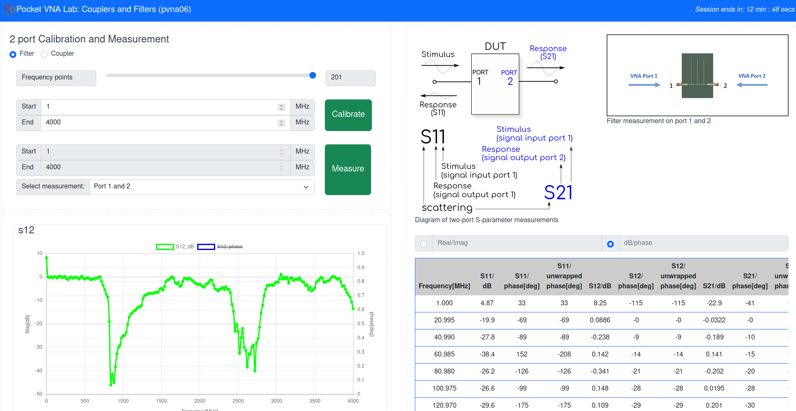
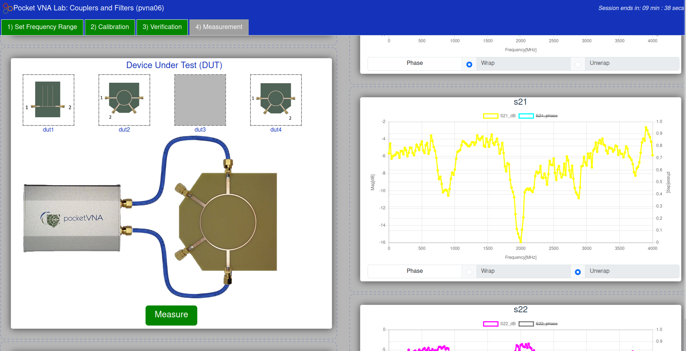

# Pocket VNA 2-port User Interface

Two interfaces are currently available for the pvna-oneport remote lab.

- [default](./default/)
- [graphical](./graphical/)


## default UI

The **default** interface is a single page app with an automated calibration procedure. Users set the number of data points as well as the start and end frequencies for calibration. After calibrating, users have access to four dut measurements: 1 filter and 3 coupler measurements.

Data (magnitude and phase) are plotted on an interactive graph: either plot can be hidden/shown by clicking the corresponding box in the graph legend. Phase can be plotted wrapped (around 180 deg) or unwrapped. Data are also provided in an on-screen table, which supports either real/imag or mag/phase representations, and can be downloaded for external manipulation as a CSV or s2p file. Four separate plots of the scattering parameters are included: s11, s12, s21 and s22.



## graphical UI

The **graphical** user interface is a multi-page app that requires a "manual" calibration procedure. Using the first tab ```1) Set Frequency range```, users set the number of data points and start and end frequencies. Once set, the ``2) Calibration`` tab is used to perform the SOLT calibration procedure: scanning and saving each calibration standard separately before the calibration can be completed. Once calibration is complete the tab turns green and provides access to the ``3) Verification`` tab, where short, open and load measurements can be verified by the user using a smith chart (and standard mag/phase plot). Once verified, the ``4) Measurement`` tab enables measurement of the four available DUTs and display of data using a table, mag/phase plot, smith chart or downloaded for external use.

Parameters set in ```1) Set Frequency range``` will be reflected at subsequent steps without being able to be changed. To update the frequency range or number of data points, return to the first tab. If values are updated here, a re-calibration will be required before any measurements can be taken again.



## Recommended settings

The number of data points is restricted to between 2 and 201, with the recommendation to using the full 201 data points,

The minimum frequency that the PocketVNA can measure is 0.5 MHz and the maximum recommended frequency is 4000 MHz. Outside of this range, the user interface will highlight an issue with the input frequency with a red box around the input.


## Build procedure

Requirements: ```npm```, all experiments are developed and built using a Linux-based OS.

The practable user interfaces use ```vite``` build tools.

The expected build procedure (not tested from scratch) is as follows:

1) Download the [pocket-vna-two-port](https://github.com/practable/pocket-vna-two-port) repo.
2) Navigate to the appropriate ui in the command line e.g.:

```
cd ~/pocket-vna-two-port/ui/default
```
3) Install all necessary packages from the 'package.json' file: ```npm install```
4) Set the ```VITE_BASE``` in ```.env.production``` to the necessary base path. 
5) Build for development and testing: ```npm run dev```
6) Build for production: ```npm run build``` - the dist folder will contain the built files for deployment

