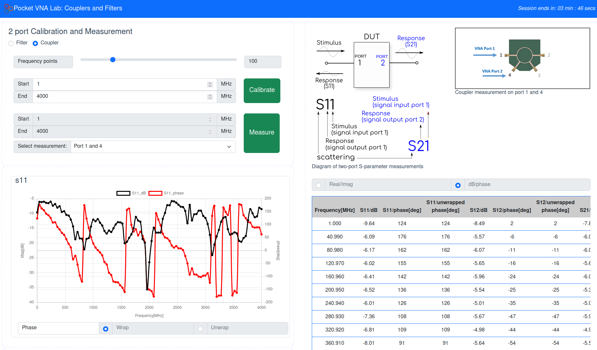
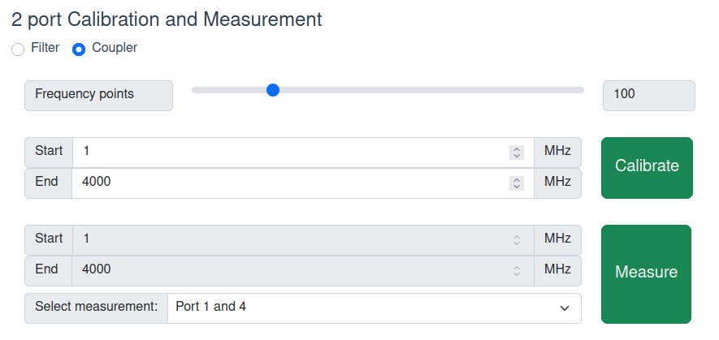
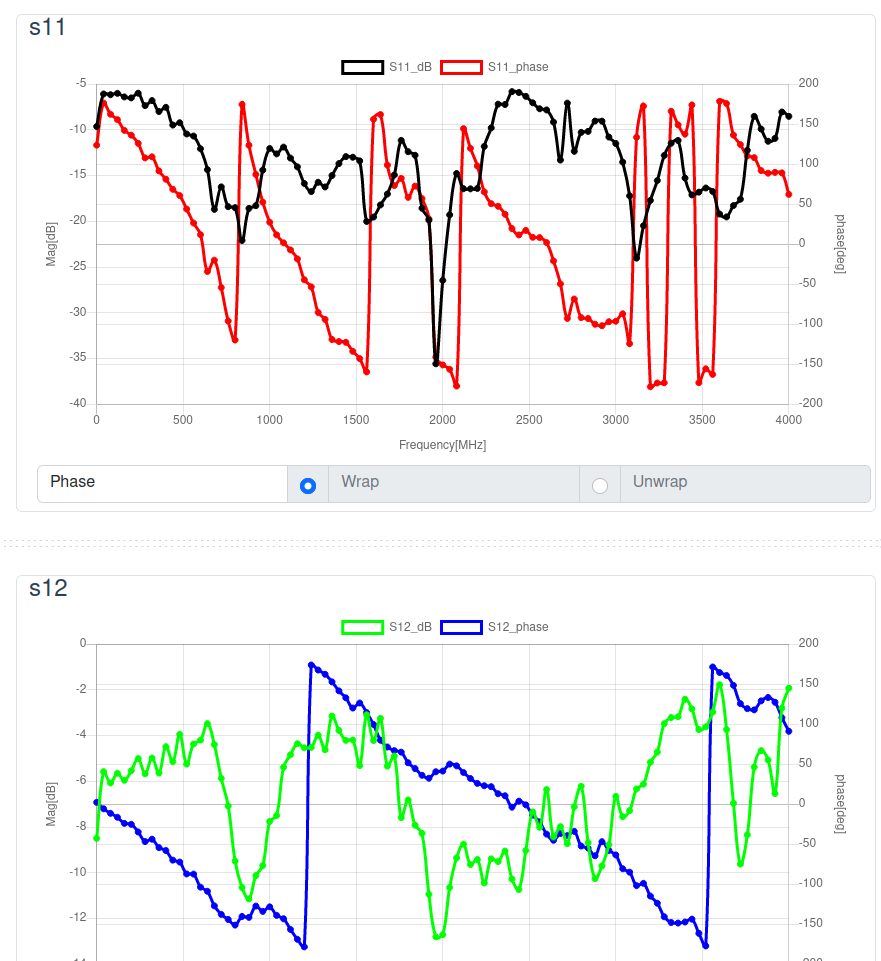
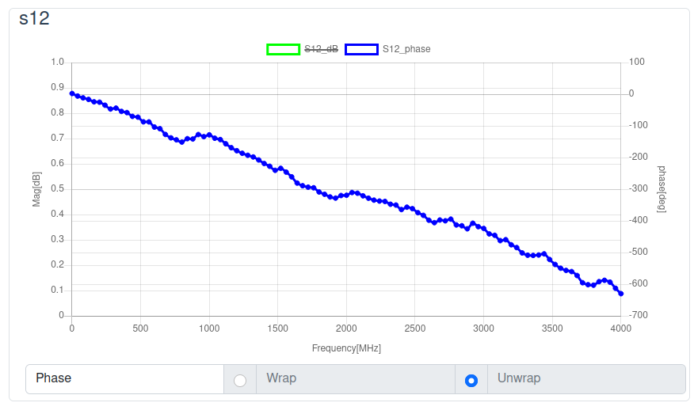
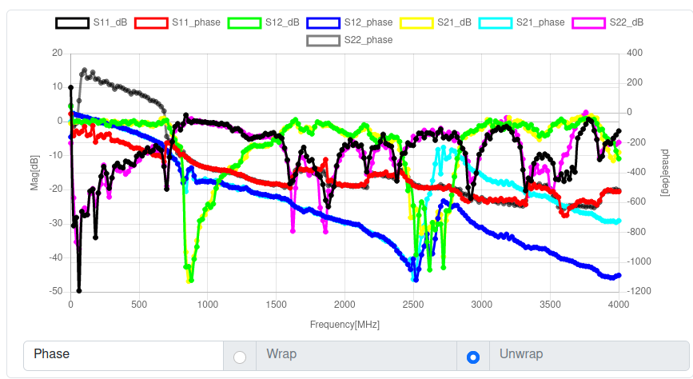

# Pocket VNA 2-port UI

This version of the UI is a temporary fix for the pocket VNA which appears to require the measurement command to be sent twice before it returns the appropriate data.

This is the user interface for the 2-port Pocket VNA remote lab experiment found [here](https://github.com/practable/pocket-vna-two-port). This UI has been created with Vue3 + Vite build tools. 



This is the basic version of the UI based upon the [main branch](https://github.com/dpreid/pvna-ui) of the 1-port Pocket VNA experiment UI.

## Temporary changes

In the ConnectAndDisplay.vue component changes have been made to force a second measurement.

```
data(){
    return {
        ...
        first_response: true,       //TEMPORARY for dealing with measurement issue in pocket VNA
    }
}

```

```
else if(response.cmd == 'crq'){
    this.previous_phase = null;
    console.log(response);
    
    
    //if this is the first reponse then resend the measurement command
    if(_this.first_response){

    _this.first_response = false;

    let params = {
        avg:1,
        sparam:{s11:true,s12:true,s21:true,s22:true},
        what: _this.getDUT
    }

    _this.$store.dispatch('requestRangeAfterCal', params);
    } 
    //if it is the second reponse then display data as expected
    else{
    _this.first_response = true;

    _this.$store.dispatch('setResponse', response);
    _this.$store.dispatch('setShowRequestModal', false);
    }

} 
```


## Getting data from the pocket VNA

All scattering parameters are calibrated and measured by the remote lab hardware, therefore the user interface has all scattering parameters selected by default for this 2 port system (S11, S12, S21 and S22) and this cannot be changed at the moment.



- Select the device you want to measure (filter or coupler) - an image of the device is shown in the upper right.
- Select a number of data points to collect, up to a maximum of 201. 
- Select the range of frequencies you want to measure over (max frequency 4000 MHz). 
- Click Calibrate and wait for the calibration to finish (the modal will disappear)
- Select the type of measurement you want to perform - updates the device image to show the ports that will be measured.
- Click Measure and wait for the data to be returned from the pocket VNA.

## Interacting with the data

### Graphs

Data for each scattering parameter will be displayed in a separate chart (as well as all data together in a 5th chart). To select which parameters to display (whether the magnitude in dB or the phase in deg) the user should toggle the options in the graph component.

Data (magnitude and phase) is automatically displayed for each scattering parameter in a separate chart:



You can toggle options (by clicking on the corresponding coloured rectangle, e.g. the green one below to remove that data)



The final chart combines all data to allow comparisons on a single chart:



### Table

The data is also displayed in a table component providing the frequency, magnitude and phase of each data point. This can also be toggled to display in terms of the real and imaginary components instead using the selection at the top of the table.


## Downloading for external use

Although data is displayed in graphs and a table on the user interface itself, it can also be downloaded for external use. To do this, select the format of the data (real/imag or dB/phase) and the file type (csv or s2p) and then click download. This will download the file to your Downloads folder which you can then open in an appropriate program.
